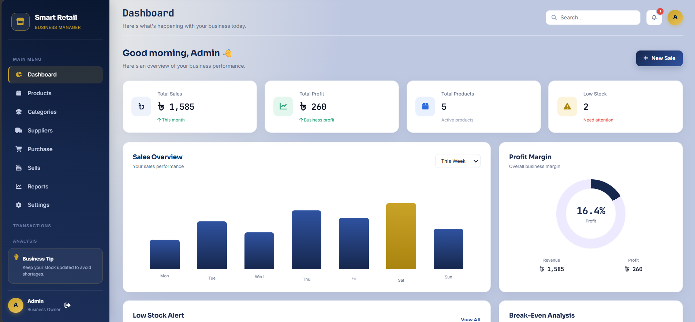

# 🏪 Smart Retail Business Manager

A web-based management system for small and medium retail businesses. Manage products, categories, suppliers, purchases, sales, profit/loss and reports from one place.

🔗 **Live Demo:** [https://monima40.github.io/smart-retain-manager/login.html)

---

## 📸 Screenshot



---

## 📖 Overview

Smart Retail Business Manager is a front-end project that lets a shop owner log in and track stock, purchases, sales and profit. Every purchase automatically increases stock, and every sale reduces stock and calculates profit. The dashboard gives a quick snapshot of overall business performance. Currency: Bangladeshi Taka (৳).

---

## 🛠️ Tech Stack

| Technology | Purpose |
|---|---|
| **HTML5** | Page structure |
| **CSS3** | Styling and responsive layout |
| **JavaScript (Vanilla, ES6)** | Business logic, data handling, UI interactions |
| **Font Awesome 6.5.0** | Icons (via CDN) |

---

## ✨ Features

- 🔐 **Authentication** – Login/logout; all pages are protected
- 📊 **Dashboard** – Total sales, total profit, total products, low-stock count, Sales Overview chart and Profit Margin
- 📦 **Products** – Add products, search, view stock and status, set minimum stock
- 🗂️ **Categories** – Organize products by category
- 🚚 **Suppliers** – Store supplier name, phone, email and address
- 🛒 **Purchase** – Record purchases from suppliers; stock updates automatically
- 💰 **Sales** – Customer details, discounts, payment methods (Cash / bKash / Card / Other), estimated profit and sales history
- ⚠️ **Low Stock Alert** – Warnings for products running low
- 📈 **Reports** – Revenue, Profit, Profit Margin, Profit & Loss summary, Best Selling Products, printable report
- ⚖️ **Break-Even Analysis** – Calculate break-even quantity from fixed cost, selling price and variable cost
- ⚙️ **Settings** – Update business information (name, phone, email, address)
- 🔔 **Notifications** and 🔍 **Global Search**

---

## 📦 Dependencies

This project needs no `npm` packages or build tools. The only external dependency is:

- [Font Awesome 6.5.0](https://fontawesome.com/) – loaded via CDN (an internet connection is needed to display icons)

---

## 📁 Project Structure

```
├── index.html          # Redirects to dashboard
├── login.html
├── dashboard.html
├── products.html
├── categories.html
├── suppliers.html
├── purchase.html
├── sales.html
├── reports.html
├── settings.html
├── css/
│   ├── base.css
│   ├── layout.css
│   ├── components.css
│   ├── dashboard.css
│   └── pages.css
└── js/
    ├── auth.js
    ├── data.js
    ├── navigation.js
    ├── modals.js
    ├── products.js
    ├── categories.js
    ├── suppliers.js
    ├── purchase.js
    ├── sales.js
    ├── dashboard.js
    ├── reports.js
    ├── search.js
    ├── notifications.js
    ├── settings.js
    └── main.js
```

---

## 🚀 Run Locally

### Prerequisites
- Any modern browser (Chrome, Firefox, Edge)
- (Optional) VS Code with the Live Server extension, or Python

### Steps

1. **Clone the repository**
```bash
   git clone https://github.com/your-username/your-repo-name.git
   cd your-repo-name
```

2. **Run the project** (choose any one)

   - **Directly:** Double-click `login.html` or `index.html` to open it in your browser.
   - **VS Code Live Server:** Right-click `index.html` and choose **Open with Live Server**.
   - **Using Python:**
```bash
     python -m http.server 8000
```
     Then open `http://localhost:8000` in your browser.

3. **Log in**
   - Username: `admin`
   - Password: `admin123`

> ⚠️ These are demo credentials for testing only. Change them before using the app for a real business.

---

## 🔗 Links

- 🌐 **Live Demo:** https://monima40.github.io/smart-retain-manager/
- 💻 **Repository:** https://github.com/monima40/smart-retain-manager
- 🐞 **Report an Issue:** https://github.com/monima40/smart-retain-manager/issues

---

## 👩‍💻 Author

**Your Name** – [GitHub](https://github.com/monima40)
